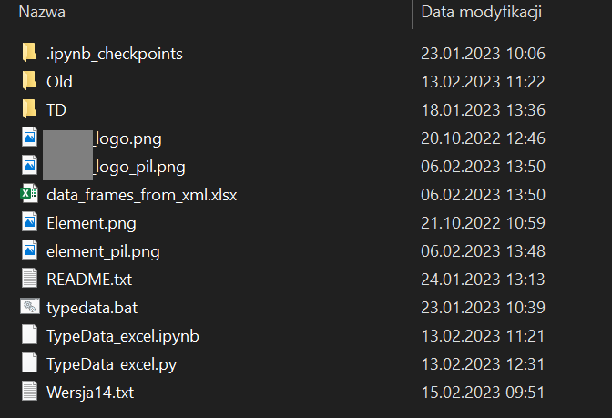

# Python---get-data-from-XML
Work project - get data from XML files, put them into DataFrame and generate .xlsx file

## Table of Contents
* [General Info](#general-information)
* [Technologies Used](#technologies-used)
* [Screenshots](#screenshots)
* [Setup](#setup)
* [Project Status](#project-status)
* [Acknowledgements](#acknowledgements)

## General Information
A project for reading information from hundreds of production XML files, modifying them and writing them back into a properly formatted XLSX file. My first project in Python.

## Technologies Used
- Python
- Libraries: ElementTree, Pandas, NumPy, OS, Ntpath, OpenPyXL
- Tools: Anaconda Prompt, Jypyter Notebook

## Screenshots

Folder view:

 

XML file:
 

Result - XLSX file:
 

## Setup
Install Anaconda3 (Anaconda Navigator). To run the program correctly: 
The code file supports relative paths and must be in a folder along with:
1. the TD folder, where you will find the following folders with XML files:
- cell02
- cell07
- cell53
- cell165
2. image files named:
- Element.png
- logo.png

Helpful site: https://miroslawmamczur.pl/srodowisko-wirtualne-w-python/

In Anaconda Prompt:
Create a typedata environment:
conda create --name typedata

activate it:
conda activate typedata

and install the appropriate libraries in Anaconda Prompt using the commands:
conda install pandas
conda install numpy
conda install openpyxl
conda install ntpath

type: call jupyter-notebook --notebook-dir="C:\Users\STJ2TW\Python"  
or run (updated with the correct path!) the typedata.bat file to open the correct typedata environment in Anaconda Prompt and open the corresponding file in Jupyter.

## Project Status
Project is: _done_.

## Acknowledgements
My colleagues from work - thank you for helping me with this project.
I can't upload full XML files with proper folders for work reasons.
This is my first project in Python.
